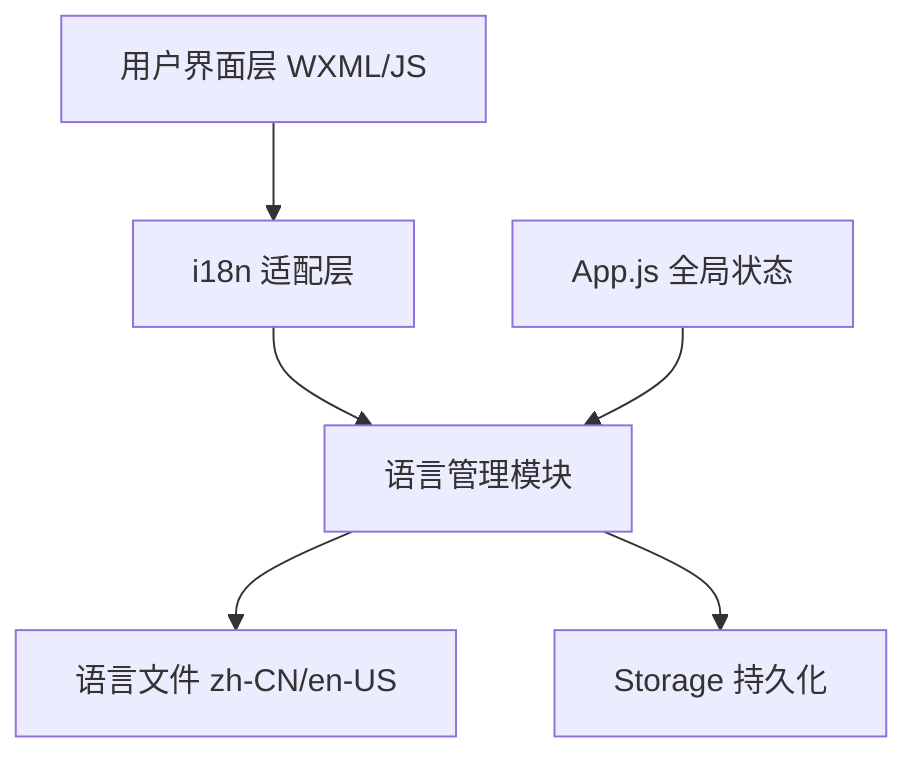
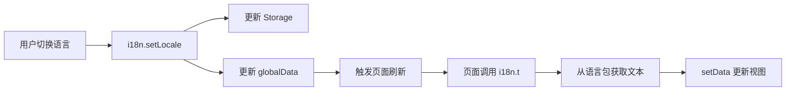

## 产品概述

为 TDesign 微信小程序 AI Chat 组件演示项目实施完整的 i18n 国际化架构,支持中英文双语切换。项目当前所有用户界面文本均为中文,需要建立标准化的多语言管理体系,提取所有面向用户的文本到语言文件,并提供专业级英文翻译。

## 核心功能

- **i18n 架构设计**: 建立小程序国际化基础设施,包括语言文件组织、语言切换机制和全局状态管理
- **文本提取与分类**: 从 54 个 WXML 文件和 70 个 JS 文件中提取约 230-330 条用户界面字符串,按功能模块和文本类型分类管理
- **专业英文翻译**: 为所有提取的中文字符串提供精准、符合 UI 语境的英文翻译,保持 Markdown 格式完整性
- **组件适配改造**: 改造页面组件和业务逻辑,使用 i18n API 替换硬编码文本,支持动态语言切换
- **语言切换功能**: 在首页添加语言选择器,实现中英文无缝切换,持久化用户语言偏好

## 技术栈

- **框架**: 微信小程序原生框架
- **组件库**: TDesign Miniprogram
- **国际化方案**: 自定义 i18n 工具类 + Storage 持久化
- **状态管理**: 小程序全局 App 实例 + globalData

## 系统架构

### 整体架构模式

采用分层架构设计,在现有项目基础上添加 i18n 能力层:



### 模块划分

#### 1. 语言文件模块 (i18n/locales/)

- **职责**: 存储所有多语言文本资源
- **技术**: JavaScript 对象导出
- **结构**:
- `zh-CN/` - 中文语言包
    - `common.js` - 通用文本(按钮、提示等)
    - `pages.js` - 页面标题和导航
    - `chat.js` - 对话相关文本
    - `components.js` - 组件文本
- `en-US/` - 英文语言包(同结构)
- `index.js` - 语言包导出入口

#### 2. i18n 工具类模块 (utils/i18n.js)

- **职责**: 提供翻译 API、语言切换、回退机制
- **核心方法**:
- `t(key, params)` - 获取翻译文本,支持插值
- `setLocale(locale)` - 切换语言
- `getLocale()` - 获取当前语言
- **依赖**: Storage API、语言文件模块

#### 3. 全局状态模块 (app.js)

- **职责**: 管理全局语言状态,初始化 i18n
- **增强字段**:
- `globalData.locale` - 当前语言标识
- `globalData.i18n` - i18n 工具实例
- **生命周期**: onLaunch 时读取存储语言偏好

#### 4. 组件适配模块 (pages/**/*.js)

- **职责**: 改造现有页面和组件,替换硬编码文本
- **模式**: 在 onLoad/onShow 中调用 i18n API 更新 data
- **涉及文件**: 54 个 WXML + 70 个 JS 文件

### 数据流



## 实现细节

### 核心目录结构

```
_example/
├── utils/
│   └── i18n.js              # 新增: i18n 工具类
├── i18n/
│   ├── index.js             # 新增: 语言包导出
│   └── locales/
│       ├── zh-CN/           # 新增: 中文语言包
│       │   ├── common.js
│       │   ├── pages.js
│       │   ├── chat.js
│       │   └── components.js
│       └── en-US/           # 新增: 英文语言包
│           ├── common.js
│           ├── pages.js
│           ├── chat.js
│           └── components.js
├── app.js                   # 修改: 初始化 i18n
├── pages/
│   ├── home/
│   │   ├── home.wxml        # 修改: 使用 i18n 变量
│   │   └── home.js          # 修改: 调用 i18n API
│   ├── chat-list/           # 修改: 54 个 WXML + 70 个 JS
│   └── ...
└── components/
    ├── trd-privacy/         # 修改: 隐私声明国际化
    └── ...
```

### 关键代码结构

**i18n 工具类核心接口**

```javascript
// utils/i18n.js
class I18n {
  constructor() {
    this.locale = 'zh-CN'; // 默认语言
    this.messages = {}; // 语言包缓存
  }
  
  // 获取翻译文本,支持嵌套键和参数插值
  t(key, params = {}) {
    const keys = key.split('.');
    let value = this.messages[this.locale];
    for (const k of keys) {
      value = value?.[k];
    }
    return this.interpolate(value || key, params);
  }
  
  // 切换语言,持久化到 Storage
  setLocale(locale) {
    this.locale = locale;
    wx.setStorageSync('locale', locale);
    getApp().globalData.locale = locale;
  }
  
  // 从 Storage 加载语言偏好
  getLocale() {
    return wx.getStorageSync('locale') || 'zh-CN';
  }
}
```

**语言包数据结构**

```javascript
// i18n/locales/zh-CN/common.js
export default {
  button: {
    confirm: '确认',
    cancel: '取消',
    send: '发送',
    stop: '停止',
  },
  toast: {
    sendSuccess: '发送成功',
    sendFailed: '发送失败',
    inputRequired: '请输入消息内容',
  },
  placeholder: {
    inputMessage: '请输入消息...',
  },
};
```

**页面组件适配模式**

```javascript
// pages/home/home.js
import i18n from '../../utils/i18n';

Page({
  data: {
    pageTitle: '',
    description: '',
  },
  
  onLoad() {
    this.updateI18n();
  },
  
  onShow() {
    // 支持语言切换后返回页面刷新
    this.updateI18n();
  },
  
  updateI18n() {
    this.setData({
      pageTitle: i18n.t('pages.home.title'),
      description: i18n.t('pages.home.description'),
    });
  },
});
```

### 技术实现方案

#### 1. 文本提取与分类策略

**问题**: 230-330 条字符串分散在多文件,需系统化管理

**方案**:

1. 按模块划分语言文件: common(通用)、pages(页面)、chat(对话)、components(组件)
2. 按文本长度分类:

- 短文本(<20字符): 按钮、标签 → `common.button.*`
- 中等文本(20-100字符): 提示消息 → `common.toast.*`
- 长文本(>100字符): 说明文档 → `components.privacy.*`

3. 使用点号路径命名: `chat.message.placeholder` 映射到 `{ chat: { message: { placeholder: '...' } } }`

#### 2. WXML 模板国际化

**问题**: WXML 静态文本需动态化

**方案**:

- **数据绑定替换**: `<text>发送</text>` → `<text>{{i18nSend}}</text>`
- **Page.data 初始化**: 在 onLoad 中调用 `i18n.t('common.button.send')` 赋值到 data
- **动态刷新**: 语言切换后,页面 onShow 重新调用 updateI18n 方法

#### 3. JS 字符串国际化

**问题**: wx.showToast、console.log 等包含硬编码中文

**方案**:

```javascript
// 修改前
wx.showToast({ title: '发送成功', icon: 'success' });

// 修改后
wx.showToast({ 
  title: i18n.t('common.toast.sendSuccess'), 
  icon: 'success' 
});
```

#### 4. JSON 配置国际化

**问题**: page.json 的 navigationBarTitleText 为静态配置

**方案**:

- 删除 JSON 中的 navigationBarTitleText 字段
- 在 Page.onLoad 中动态设置: `wx.setNavigationBarTitle({ title: i18n.t('pages.chatList.title') })`

#### 5. 语言切换交互

**实现步骤**:

1. 在 home.wxml 顶部添加语言选择器(Dropdown 或 ActionSheet)
2. 选择语言触发 `i18n.setLocale('en-US')`
3. 当前页面调用 `this.updateI18n()` 刷新
4. 通过 `wx.reLaunch` 重启首页,所有页面重新加载新语言

### 性能优化

- **按需加载**: 仅加载当前语言包,不加载全部语言
- **缓存机制**: 语言包加载后缓存到内存,避免重复读取
- **局部刷新**: 语言切换时仅 setData 变化的字段,不重新渲染整个页面

### 日志记录

- 在 i18n.t 方法中添加未找到 key 的 console.warn 日志
- 记录语言切换事件: `console.log('[i18n] Locale changed to:', locale)`

### 翻译质量保障

- **上下文理解**: 根据 UI 场景翻译(如 "发送" 在按钮中译为 "Send",在状态中译为 "Sending")
- **术语一致性**: 建立术语表(如 "对话" 统一译为 "Chat")
- **格式保留**: Markdown 语法、变量插值符号 `{{}}` 必须保持不变
- **审核机制**: 翻译完成后进行 UI 预览测试,确保文本不溢出、语义准确

## Agent Extensions

### MCP

- **tdesign-mcp-server**
- **用途**: 查询 TDesign 组件库文档,了解 Navbar、Tabs、ActionSheet 等组件的 API 用法,确保 i18n 改造后组件调用正确
- **预期成果**: 获取 t-navbar、t-tabs、t-action-sheet 组件的属性列表,验证动态设置 title 等属性的方法

- **tcsas-devtools-mcp-server**
- **用途**: 在 TCSAS DevTools IDE 中预览小程序运行效果,实时查看 i18n 改造后的中英文界面显示,捕获运行时错误
- **预期成果**: 获取小程序运行日志和截图,验证语言切换功能和文本显示正确性,发现布局问题或翻译错误